# Software Design Document

## Road Trip Advisor Web Application

Version 1.0  
Printed: November 7th, 2018

**Road Trip Advisor Team:**  
Beverly Ackah, Frederick Wirtz, Shaila Hirji

**Supervisor:** Dr Fatma Serce  
Bellevue College

---

## Revisions

| Version | Primary Author | Description of Version | Date Completed |
|---------|---------------|------------------------|----------------|
| 1.0 | Beverly Ackah, Shaila Hirji, Frederick Wirtz | Initial Release | |
| 1.1 | Frederick Wirtz | Updated based on Fatma's remarks | 11/28/18 |

---

## Table of Contents

1. [Introduction](#1-introduction)
   - 1.1 [Purpose](#11-purpose)
   - 1.2 [Scope](#12-scope)
   - 1.3 [Definitions, Acronyms and Abbreviations](#13-definitions-acronyms-and-abbreviations)
   - 1.4 [References](#14-references)
2. [System Overview](#2-system-overview)
3. [System Components](#3-system-components)
   - 3.1 [Decomposition Description](#31-decomposition-description)
   - 3.2 [Dependency Description](#32-dependency-description)
   - 3.3 [Interface Description](#33-interface-description)
     - 3.2.1 [Trip Planner to Session Manager Interface](#321-trip-planner-to-session-manager-interface)
     - 3.2.2 [Trip Planner to Optimized Path Finder Interface](#322-trip-planner-to-optimized-path-finder-interface)
     - 3.2.3 [Trip Planner to User Profile Interface](#323-trip-planner-to-user-profile-interface)
     - 3.2.4 [Trip Planner to UI Controller Interface](#324-trip-planner-to-ui-controller-interface)
   - 3.4 [Module Interfaces](#34-module-interfaces)
   - 3.5 [User Interfaces (GUI)](#35-user-interfaces-gui)
4. [Detailed Design](#4-detailed-design)
   - 4.1 [Module Detailed Design](#41-module-detailed-design)
     - 4.1.1 [Mark Current Location](#411-mark-current-location)
   - 4.2 [Data Detailed Design](#42-data-detailed-design)
   - 4.3 [RTM](#43-rtm)

---

## 1. Introduction

### 1.1 Purpose

The Software Design Document describes the architecture and system design for Road Trip Adviser, a road trip planning website. Road Trip Adviser is designed to help travelers plan and oversee their trip. This document is intended for Project Managers, Software Engineers, and anyone else who will be involved in the implementation of the system.

### 1.2 Scope

This document describes the implementation details of the Road Trip Advisor (RTA) Web Application. RTA will consist of six major components: Trip Planning, Database, Optimization, Map, User, and Authentication. Each of the components will be explained in details in this Software Design Document.

### 1.3 Definitions, Acronyms and Abbreviations

| Acronym | Meaning |
|---------|---------|
| RTA | Road Trip Advisor |
| SDD | Software Design Document |
| OS | Operating System |
| API | Application Programming Interface |

### 1.4 References

- Google Maps JavaScript API
- Bootstrap React
- Anastasov, Nick. "Making Your First Web App with React." *Tutorialzine*, 22 Apr. 2015, tutorialzine.com/2015/04/first-webapp-react.
- Mead, Andrew. "The Complete React Web Developer Course (with Redux)." *Udemy*, May 2018, www.udemy.com/react-2nd-edition/.
- Njeri, Rachael. "React Apps with the Google Maps API and Google-Maps-React." *Scotch*, Oct. 2018, scotch.io/tutorials/react-apps-with-the-google-maps-api-and-google-maps-react.
- Ackah, Beverly, Hirji, Shaila, Wirtz Frederick. *"Software Requirement Specification"* Oct. 2018, https://docs.google.com/document/d/1aLGlXoLIEamAil1PFfOe-jgGSpmQ2hZ8G58vHGNznX4/edit?usp=sharing

---

## 2. System Overview

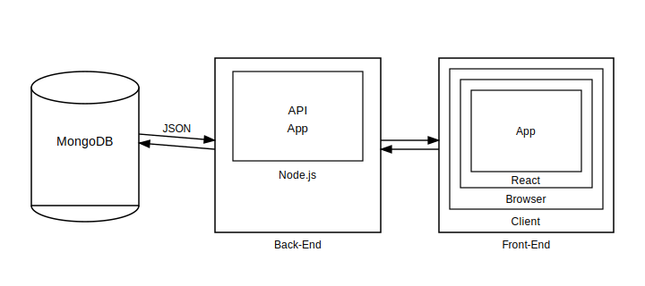

*FIGURE 1*

Figure 1 above represents the architectural structure we have chosen for the development of the RTA. The backend will be incharge of communicating and pulling information from all the APIs the RTA system is dependent on. We decided to go with NodeJS as our framework as it provides fast, efficient and tight coupling between the client and the server amongst other additional features. NodeJS is also highly scalable which will allow the system to grow further and accommodate a wider range of customers.

The RTA system will also be storing information about its users as well as details about trips that other users have planned. Storing these details will enable our system to be more efficient in the long run as we can visit the database for same route trips and just make real time updates on the time duration of the trip. Saving route details will also allow the system to suggest trips to users based of other users with similar preferences. Storing user information will enable the system to maintain user profile and keep records of their trips.

Additionally, by following this architecture and structure, we can further extend, if we wish, the RTA system into being a mobile application since the backend will be all set.

---

## 3. System Components

### 3.1 Decomposition Description

**Top Down Details**

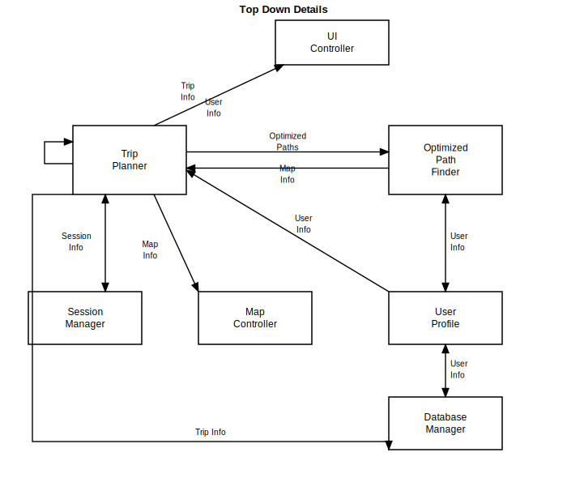

*FIGURE 2*

Figure 2 above shows a top down description of how the web application is expected to work and how components will interact with one another. The trip planner is the main component. The trip planner can save and recall trips from the database manager. The session manager is for logging in, logging out, and authenticating users. The trip planner can get and update user profiles that are saved with the database manager. The trip planner will use the optimized path finder to create routes. The optimized pathfinder can create routes usings the user info provided by the user profile. Finally, the UI controller, shows how the user interacts with the road trip adviser application.

### 3.2 Dependency Description

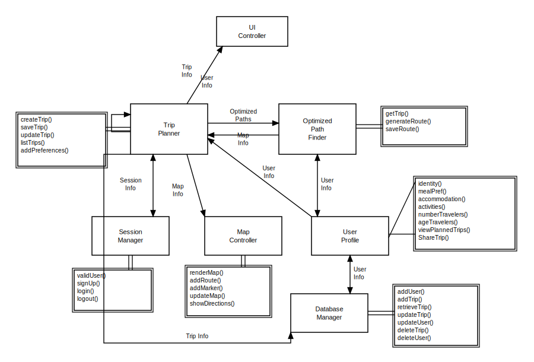

*FIGURE 3*

Figure 3 above represents the component diagram of the RTA system and how each module is dependent on another for its functionality. Double lines are used to show functions that are attached to modules. Via the UI controller, the user is expected to enter details about their trip that flow into our first module, Trip Planner. Trip Planner will use the Session Manager to authenticate the current user. After being authenticated, user info will be retrieved from the user profile. If the user is part of the system, the system can retrieve their saved preferences required to plan the trip. If the user is not a member, they will be prompted to enter their preferences. The preferences are stored within the database manager via the user profile.

On collecting all the desired details, the trip planner will progress through the optimized pathfinder module which will generate an optimized route based of the user input. The optimized routes will be stored into our database for future reference by the trip planner.

The trip planner will pull the map data from the map controller and combine it with the route from the optimized path finder. Displaying the route in the UI controller. The Map module will also handle features like updating the map as user changes their preferences and stops and show a detailed list of directions for the journey.

Most of the data from the user and from planned optimized trips will be stored into our database as long as the user is an authorized member of the system.

### 3.3 Interface Description

#### 3.2.1 Trip Planner to Session Manager Interface

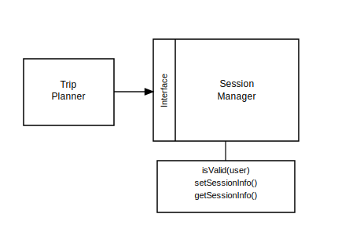

#### 3.2.2 Trip Planner to Optimized Path Finder Interface

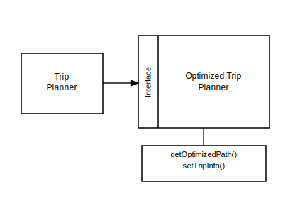

#### 3.2.3 Trip Planner to User Profile Interface


#### 3.2.4 Trip Planner to UI Controller Interface

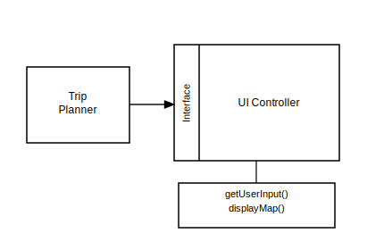

### 3.4 Module Interfaces

the diagram we briefly touched on in Software engineering.

### 3.5 User Interfaces (GUI)

Returning and first time users, when visiting the Road Trip Advisor website will be presented with an initial landing page (figure 1). This screen offers the user the option of exploring how trips are planned by going straight to planning a trip. The user can enter a location and a destination to start planning the desired trip. The 'Search' button will render a path of from the location and destination entered.

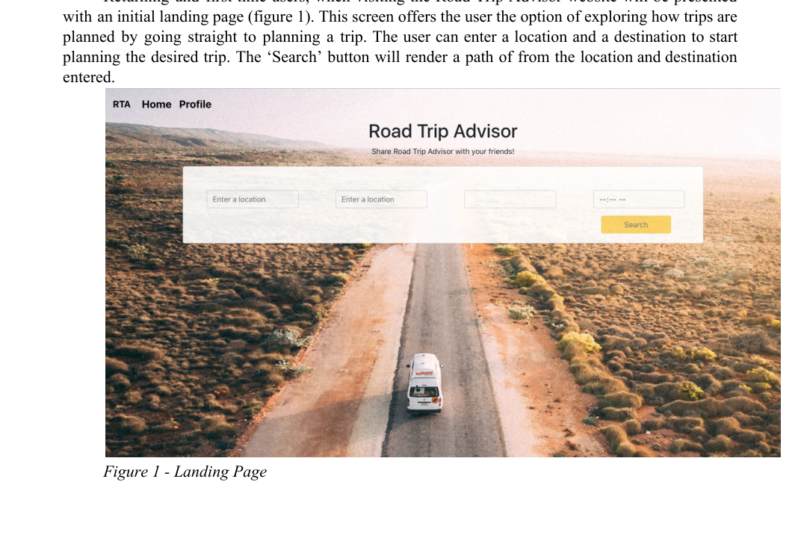

*Figure 1 - Landing Page*

Figure 2 displays the Meal Preferences page. The user can select a meal type and filter it based of the price range and the distance from the location enabling us to further customize the trip to their preferences.

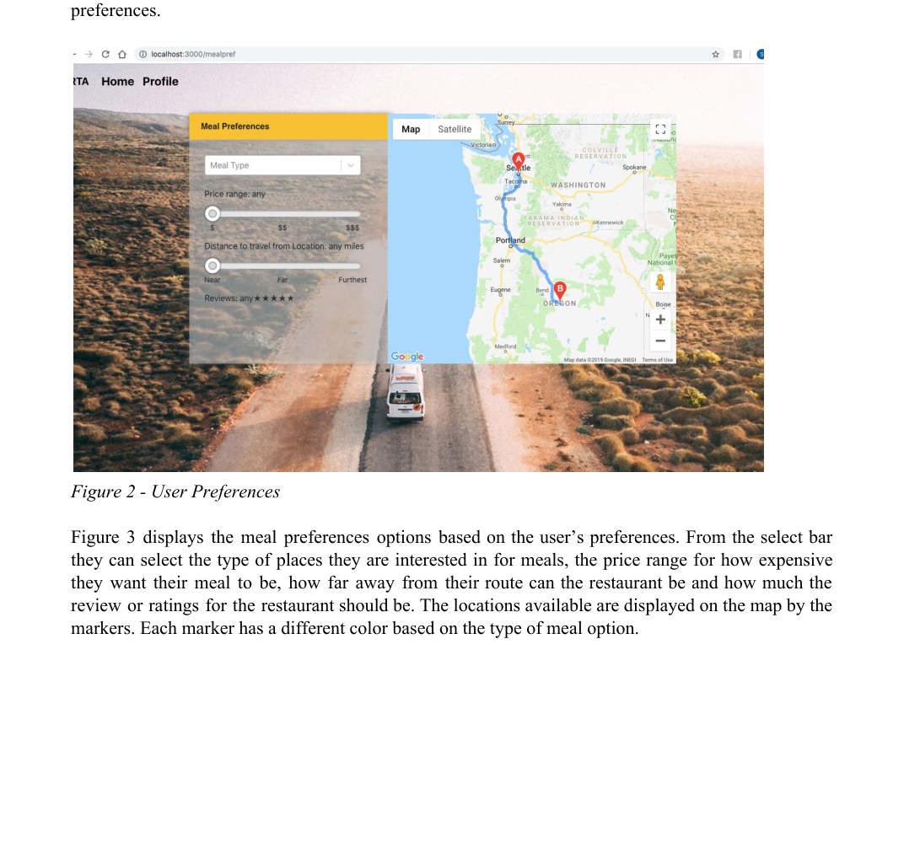

*Figure 2 - User Preferences*

Figure 3 displays the meal preferences options based on the user's preferences. From the select bar they can select the type of places they are interested in for meals, the price range for how expensive they want their meal to be, how far away from their route can the restaurant be and how much the review or ratings for the restaurant should be. The locations available are displayed on the map by the markers. Each marker has a different color based on the type of meal option.

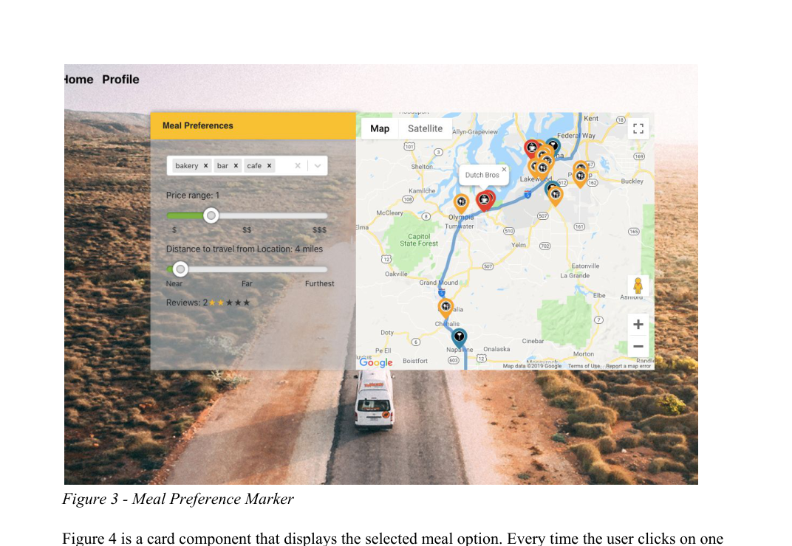

*Figure 3 - Meal Preference Marker*

Figure 4 is a card component that displays the selected meal option. Every time the user clicks on one of the meal option, it will be displayed on the card component.

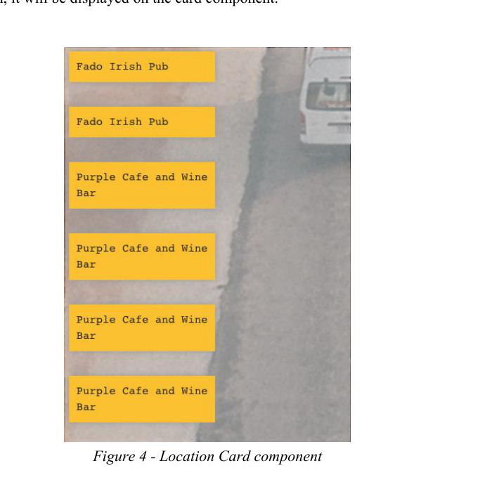

*Figure 4 - Location Card component*

---

## 4. Detailed Design

### 4.1 Module Detailed Design

#### 4.1.1 Mark Current Location

##### Sequence Diagrams

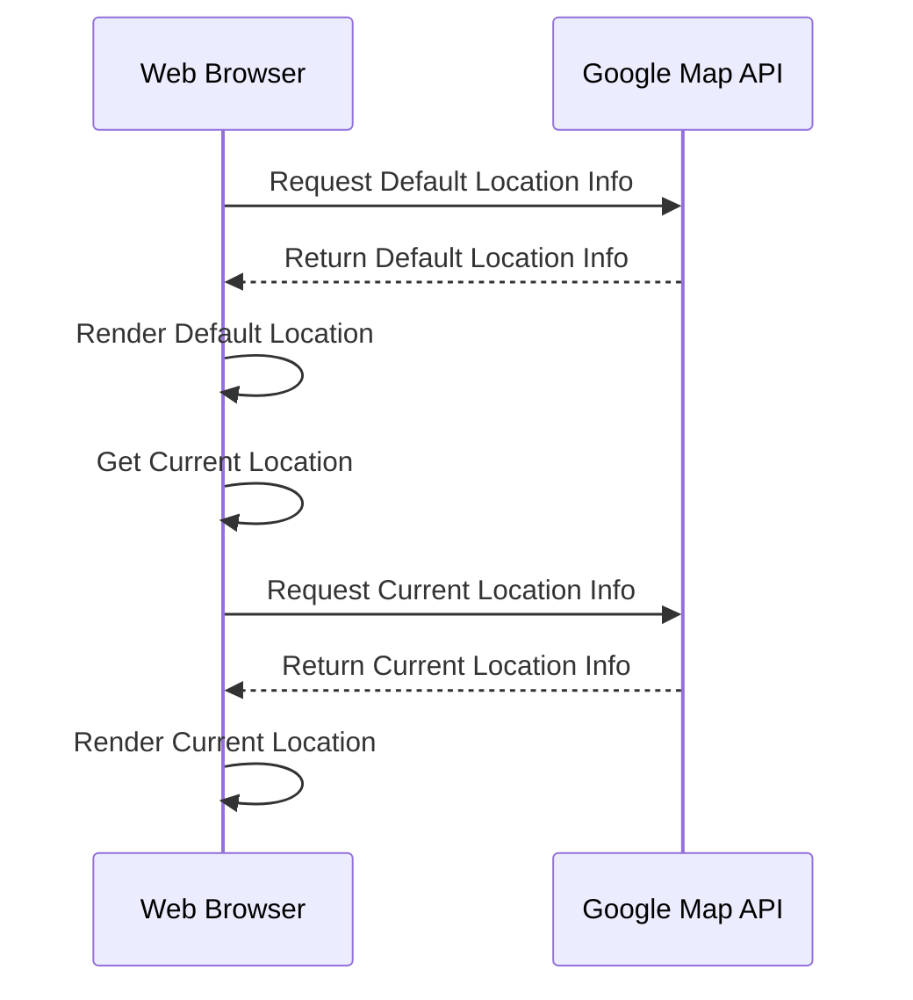

##### Pseudocode

```
Browser shows default location on google maps
    Request default location information with google's api
    Google returns default location
Uses browser to get current location
Request current location information from google api
Google's API returns current locations info
Browsers renders current location
```

### 4.2 Data Detailed Design

### 4.3 RTM

| Requirement-ID | Requirement Description | Design Component | Test-Case # |
|----------------|------------------------|------------------|-------------|
| 3.2.1.1 | User access to website | Session Manager | 3.1 |
| 3.2.1.2 | Register a profile | User Profile and Database Manager | 3.16 |
| 3.2.1.3 | Planning a trip | Optimized Path Finder | 3.7, 3.8, 3.9, 3.10, 3.11, 3.12, 3.13 |
| 3.2.1.4 | Login to profile (edit, plan, view saved trips) | Session Manager | 3.14, 3.15, 3.16, 3.18, 3.19, 3.20 |
| 3.2.2.1 | Edit/adjust details for current and upcoming trips | Database Manager | 3.22 |
