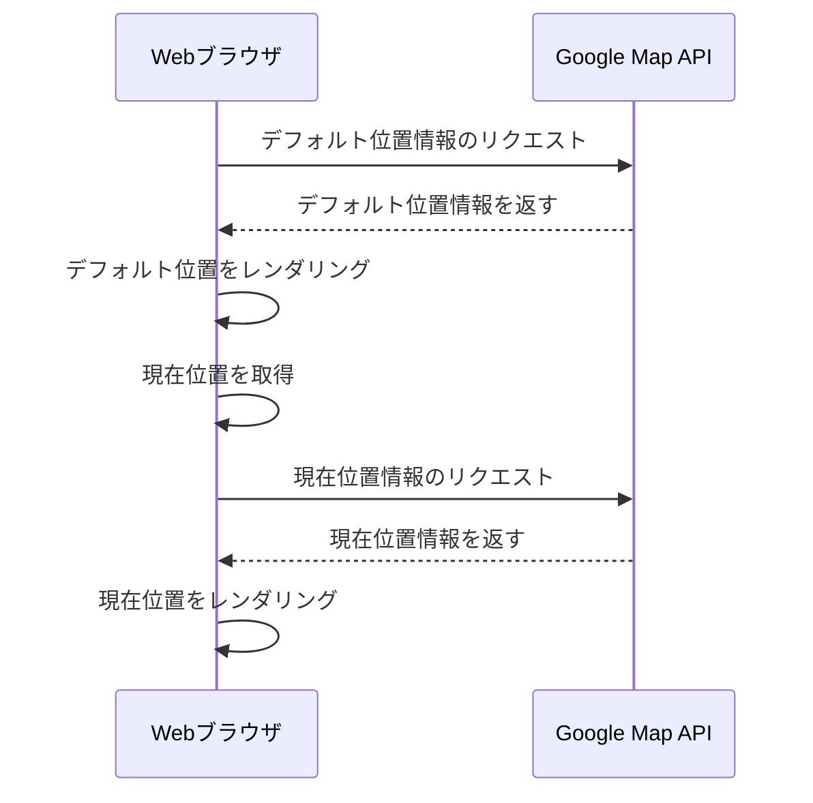

# ソフトウェア設計ドキュメント

## Road Trip Advisor Webアプリケーション

バージョン 1.0  
印刷日：2018年11月7日

**Road Trip Advisorチーム：**  
Beverly Ackah、Frederick Wirtz、Shaila Hirji

**指導教員：** Dr Fatma Serce  
Bellevue College

---

## 改訂履歴

| バージョン | 主要著者 | 改訂内容 | 完了日 |
|-----------|---------|---------|-------|
| 1.0 | Beverly Ackah、Shaila Hirji、Frederick Wirtz | 初版リリース | |
| 1.1 | Frederick Wirtz | Fatmaのコメントに基づき更新 | 11/28/18 |

---

## 目次

1. [はじめに](#1-はじめに)
   - 1.1 [目的](#11-目的)
   - 1.2 [スコープ](#12-スコープ)
   - 1.3 [定義・頭字語・略語](#13-定義頭字語略語)
   - 1.4 [参考文献](#14-参考文献)
2. [システム概要](#2-システム概要)
3. [システムコンポーネント](#3-システムコンポーネント)
   - 3.1 [分解説明](#31-分解説明)
   - 3.2 [依存関係の説明](#32-依存関係の説明)
   - 3.3 [インターフェース説明](#33-インターフェース説明)
     - 3.2.1 [Trip Planner〜Session Manager インターフェース](#321-trip-plannersession-managerインターフェース)
     - 3.2.2 [Trip Planner〜Optimized Path Finder インターフェース](#322-trip-planneroptimized-path-finderインターフェース)
     - 3.2.3 [Trip Planner〜User Profile インターフェース](#323-trip-planneruser-profileインターフェース)
     - 3.2.4 [Trip Planner〜UI Controller インターフェース](#324-trip-plannerui-controllerインターフェース)
   - 3.4 [モジュールインターフェース](#34-モジュールインターフェース)
   - 3.5 [ユーザーインターフェース（GUI）](#35-ユーザーインターフェースgui)
4. [詳細設計](#4-詳細設計)
   - 4.1 [モジュール詳細設計](#41-モジュール詳細設計)
     - 4.1.1 [現在位置のマーク](#411-現在位置のマーク)
   - 4.2 [データ詳細設計](#42-データ詳細設計)
   - 4.3 [RTM（要件トレーサビリティマトリクス）](#43-rtm要件トレーサビリティマトリクス)

---

## 1. はじめに

### 1.1 目的

本ソフトウェア設計ドキュメントは、ロードトリップ計画Webサイト「Road Trip Adviser」のアーキテクチャおよびシステム設計について記述するものです。Road Trip Adviserは、旅行者が旅行を計画・管理するための支援を目的として設計されています。本ドキュメントは、プロジェクトマネージャー、ソフトウェアエンジニア、およびシステムの実装に携わるすべての関係者を対象としています。

### 1.2 スコープ

本ドキュメントは、Road Trip Advisor（RTA）Webアプリケーションの実装詳細について記述します。RTAは、Trip Planning（旅行計画）、Database（データベース）、Optimization（最適化）、Map（地図）、User（ユーザー）、Authentication（認証）の6つの主要コンポーネントで構成されます。各コンポーネントの詳細については、本ソフトウェア設計ドキュメントで説明します。

### 1.3 定義・頭字語・略語

| 頭字語 | 意味 |
|-------|------|
| RTA | Road Trip Advisor |
| SDD | ソフトウェア設計ドキュメント（Software Design Document） |
| OS | オペレーティングシステム（Operating System） |
| API | アプリケーションプログラミングインターフェース（Application Programming Interface） |

### 1.4 参考文献

- Google Maps JavaScript API
- Bootstrap React
- Anastasov, Nick. "Making Your First Web App with React." *Tutorialzine*, 22 Apr. 2015, tutorialzine.com/2015/04/first-webapp-react.
- Mead, Andrew. "The Complete React Web Developer Course (with Redux)." *Udemy*, May 2018, www.udemy.com/react-2nd-edition/.
- Njeri, Rachael. "React Apps with the Google Maps API and Google-Maps-React." *Scotch*, Oct. 2018, scotch.io/tutorials/react-apps-with-the-google-maps-api-and-google-maps-react.
- Ackah, Beverly, Hirji, Shaila, Wirtz Frederick. *「ソフトウェア要件仕様書（Software Requirement Specification）」* 2018年10月, https://docs.google.com/document/d/1aLGlXoLIEamAil1PFfOe-jgGSpmQ2hZ8G58vHGNznX4/edit?usp=sharing

---

## 2. システム概要


*図1*

図1は、RTAの開発に採用したアーキテクチャ構造を示しています。バックエンドは、RTAシステムが依存するすべてのAPIとの通信およびデータ取得を担当します。フレームワークとしてNodeJSを採用しました。NodeJSはクライアントとサーバー間の高速・効率的な密結合を実現するほか、多くの追加機能を提供します。また、NodeJSは高いスケーラビリティを持ち、システムの拡張や幅広い顧客層への対応を可能にします。

RTAシステムは、ユーザー情報に加え、他のユーザーが計画した旅行の詳細も保存します。これらの情報を保存することで、同一ルートの旅行についてはデータベースを参照するだけでよくなり、所要時間のリアルタイム更新のみで対応できるため、システムの長期的な効率が向上します。ルート詳細を保存することで、類似する好みを持つ他のユーザーの旅行を参考にした提案も可能になります。ユーザー情報の保存により、ユーザープロフィールの管理および旅行履歴の記録が実現します。

さらに、このアーキテクチャ・構造に従うことで、バックエンドがすでに整備されているため、将来的にRTAシステムをモバイルアプリケーションへ拡張することも容易です。

---

## 3. システムコンポーネント

### 3.1 分解説明

**トップダウン詳細**


*図2*

図2は、Webアプリケーションがどのように動作し、各コンポーネントがどのように連携するかをトップダウンで示しています。Trip Plannerが中心となるコンポーネントです。Trip PlannerはDatabase Managerから旅行の保存・呼び出しを行います。Session Managerはログイン・ログアウト・ユーザー認証を担当します。Trip PlannerはDatabase Managerに保存されたユーザープロフィールの取得・更新を行います。Trip PlannerはOptimized Path Finderを使用してルートを作成します。Optimized Path FinderはUser Profileが提供するユーザー情報を基にルートを生成します。最後に、UI ControllerはユーザーがRoad Trip Adviserアプリケーションと対話する方法を示します。

### 3.2 依存関係の説明


*図3*

図3は、RTAシステムのコンポーネント図であり、各モジュールが機能するために別のモジュールにどのように依存しているかを示しています。二重線はモジュールに付属する関数を示します。UI Controllerを通じて、ユーザーは旅行の詳細を入力し、その情報が最初のモジュールであるTrip Plannerに渡されます。Trip PlannerはSession Managerを使用して現在のユーザーを認証します。認証後、User Profileからユーザー情報が取得されます。ユーザーがシステムのメンバーである場合、旅行計画に必要な保存済みの好みを取得できます。メンバーでない場合は、好みを入力するよう促されます。入力された好みはUser Profileを介してDatabase Managerに保存されます。

必要な情報がすべて収集されると、Trip PlannerはOptimized Path Finderモジュールを経由し、ユーザー入力に基づいた最適ルートを生成します。最適化されたルートは、Trip Plannerが将来参照できるようデータベースに保存されます。

Trip PlannerはMap Controllerから地図データを取得し、Optimized Path Finderが生成したルートと組み合わせて、UI Controllerにルートを表示します。Mapモジュールは、ユーザーが好みや経由地を変更した際の地図の更新、および旅程の詳細な案内リストの表示も担当します。

ユーザーおよび計画された最適化旅行のデータの大部分は、ユーザーがシステムの認証済みメンバーである限り、データベースに保存されます。

### 3.3 インターフェース説明

#### 3.2.1 Trip Planner〜Session Managerインターフェース


#### 3.2.2 Trip Planner〜Optimized Path Finderインターフェース


#### 3.2.3 Trip Planner〜User Profileインターフェース


#### 3.2.4 Trip Planner〜UI Controllerインターフェース


### 3.4 モジュールインターフェース

ソフトウェア工学の授業で簡単に触れた図を参照。

### 3.5 ユーザーインターフェース（GUI）

リピーターおよび初回ユーザーがRoad Trip AdvisorのWebサイトを訪問すると、最初にランディングページ（図1）が表示されます。この画面では、旅行計画の方法を確認しながらそのまま計画を始めることができます。ユーザーは出発地と目的地を入力して旅行計画を開始できます。「Search（検索）」ボタンを押すと、入力した出発地から目的地までのルートが表示されます。


*図1 - ランディングページ*

図2は食事の好み設定ページです。ユーザーは食事の種類を選択し、価格帯や現在地からの距離でフィルタリングすることで、旅行をさらに自分好みにカスタマイズできます。


*図2 - ユーザー設定*

図3は、ユーザーの好みに基づいた食事オプションの選択画面です。セレクトバーから、食事に求めるスポットの種類・価格帯・ルートからの距離・レストランのレビューや評価の基準を選択できます。利用可能な場所はマーカーで地図上に表示されます。各マーカーは食事の種類に応じて異なる色で表示されます。


*図3 - 食事マーカー*

図4は、選択した食事オプションを表示するカードコンポーネントです。ユーザーが食事オプションをクリックするたびに、そのスポット情報がカードコンポーネントに表示されます。


*図4 - ロケーションカードコンポーネント*

---

## 4. 詳細設計

### 4.1 モジュール詳細設計

#### 4.1.1 現在位置のマーク

##### シーケンス図



##### 疑似コード

```
ブラウザがGoogle Maps上にデフォルト位置を表示する
    Google APIにデフォルト位置情報をリクエストする
    GoogleがデフォルトSの位置情報を返す
ブラウザを使用して現在位置を取得する
Google APIに現在位置情報をリクエストする
Google APIが現在位置情報を返す
ブラウザが現在位置をレンダリングする
```

### 4.2 データ詳細設計

### 4.3 RTM（要件トレーサビリティマトリクス）

| 要件ID | 要件説明 | 設計コンポーネント | テストケース# |
|--------|---------|-----------------|-------------|
| 3.2.1.1 | Webサイトへのアクセス | Session Manager | 3.1 |
| 3.2.1.2 | プロフィール登録 | User Profile、Database Manager | 3.16 |
| 3.2.1.3 | 旅行の計画 | Optimized Path Finder | 3.7、3.8、3.9、3.10、3.11、3.12、3.13 |
| 3.2.1.4 | プロフィールへのログイン（編集・計画・保存済み旅行の閲覧） | Session Manager | 3.14、3.15、3.16、3.18、3.19、3.20 |
| 3.2.2.1 | 現在および予定の旅行詳細の編集・調整 | Database Manager | 3.22 |
